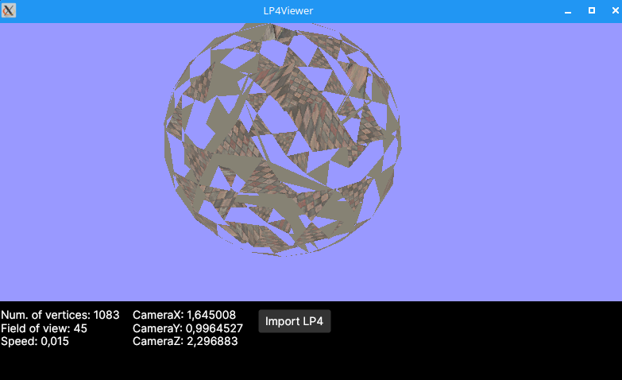

# LP4 viewer

Note: This software is in reallly early development, it doesn't work really well right now...

Allows you to somewhat view 3D models from Flipnic LP4 files. Really it just lets you display a bunch of floats from those files in 3D space.

At this point, the file must be passed as a CLI argument, otherwise it'll not open.

## Controls

* WASD - Move left, right, back, forward
* Shift - Move down
* Space - Move up
* Mouse drag - Look around
* Scroll - Change field of view (FOV)
* Ctrl (hold) - Move faster
